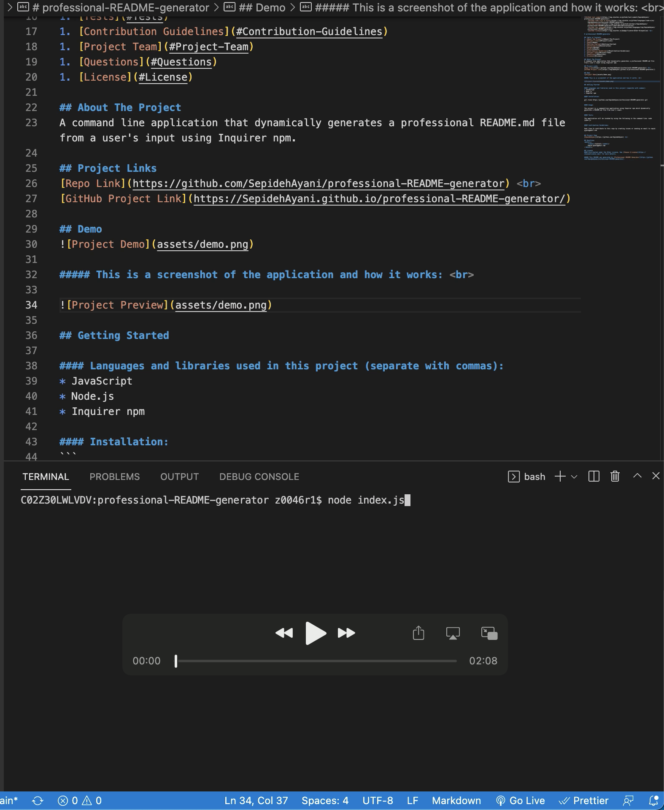

  
      
      
      
     <br> 

# professional-README-generator
    
## Table of Contents 
1. [About the Project](#About-The-Project)
1. [Project Links](#Project-Links)
1. [Demo](#Demo)
1. [Getting Started](#Getting-Started)
1. [Installation](#Installation)
1. [Usage](#Usage)
1. [Tests](#Tests)
1. [Contribution Guidelines](#Contribution-Guidelines)
1. [Project Team](#Project-Team)
1. [Questions](#Questions)
1. [License](#License)
    
## About The Project
A command line application that dynamically generates a professional README.md file from a user's input using Inquirer npm. 
    
## Project Links
[Repo Link](https://github.com/SepidehAyani/professional-README-generator) <br>
[GitHub Project Link](https://SepidehAyani.github.io/professional-README-generator/)
    
## Demo
    
##### This is a screenshot of the application and how it works: <br>
    


    
## Getting Started
    
#### Languages and libraries used in this project (separate with commas):
* Node.js
* JavaScript 
* Inquirer npm
    
#### Installation: 
```  
git clone https://github.com/SepidehAyani/professional-README-generator.git
```

#### Usage:
```  
The project is a command-line application using Inquirer npm which dynamically generates a README.md file from user's input.
```

#### Tests:
```  
The application will be invoked by using the following in the command line: node index.js
```

#### Contribution Guidelines:
```  
Feel free to contribute to this repo by creating issues or sending an email to sepid.ayani@gmail.com
```
    
## Project Team
[SepidehAyani](https://github.com/SepidehAyani) <br>

## Questions
<details>
    <summary>Contact</summary>
    sepid.ayani@gmail.com
</details>
    
## License
#### Distributed under the MIT License. See [Choose A License](https://choosealicense.com/) for more details.

##### This README was generated by [Professional README Generator](https://github.com/SepidehAyani/professional-README-generator).